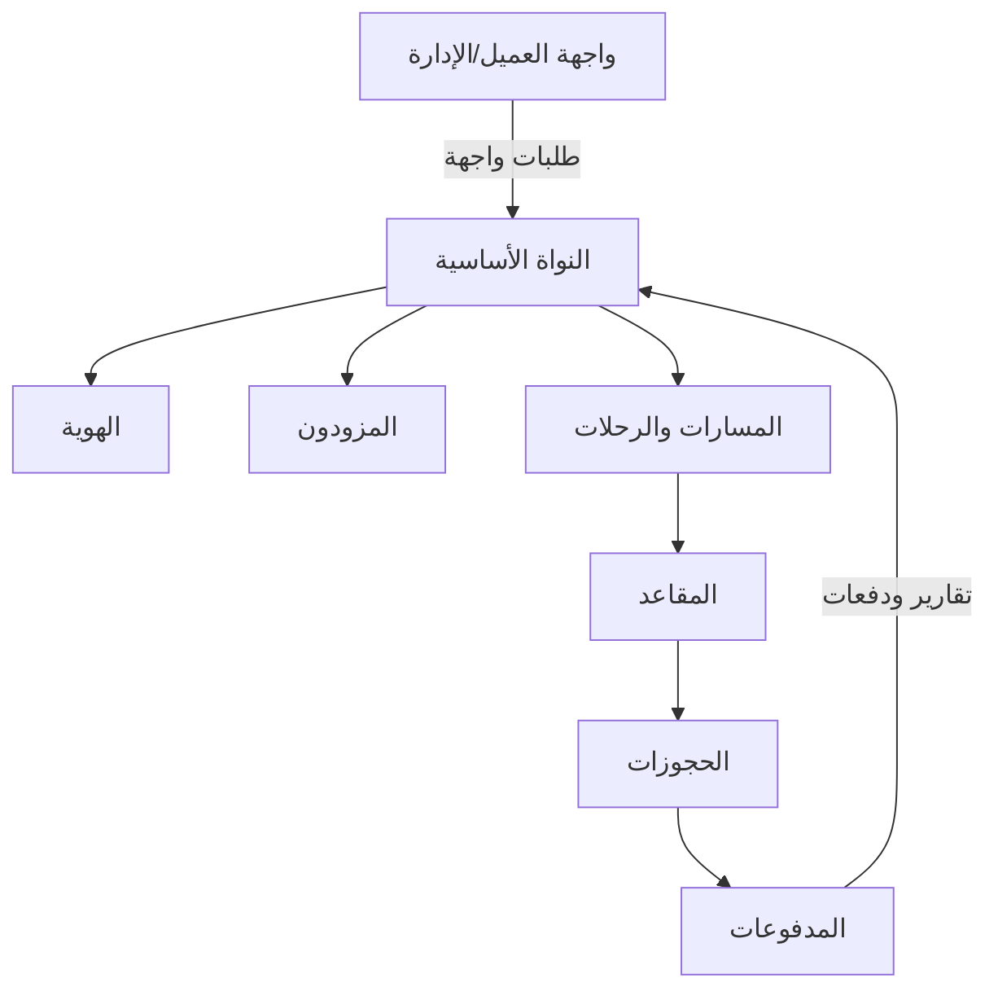
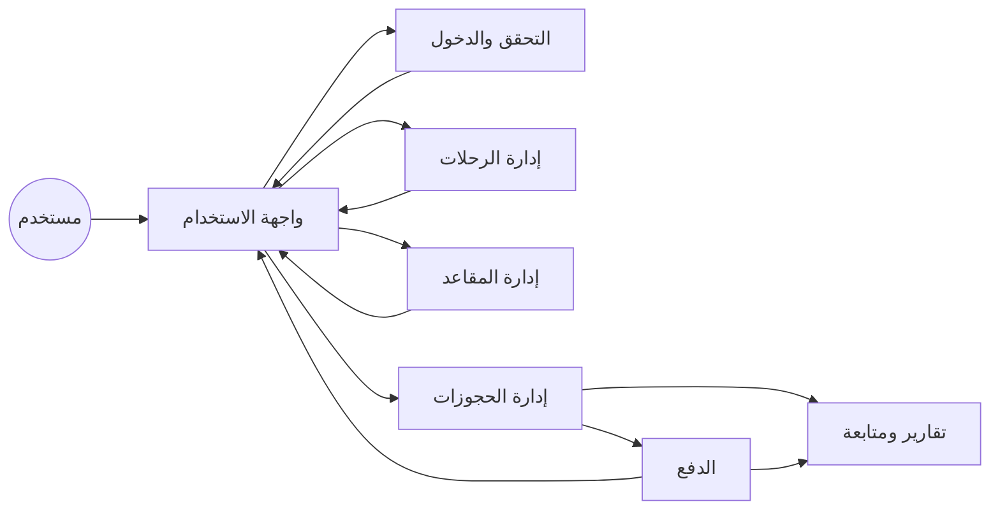
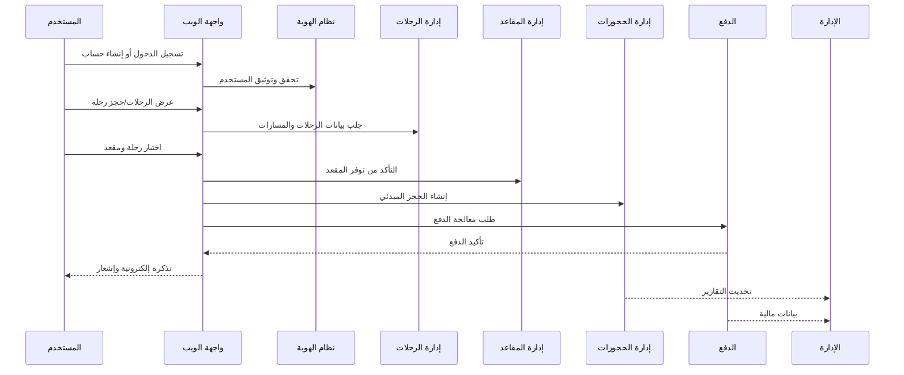
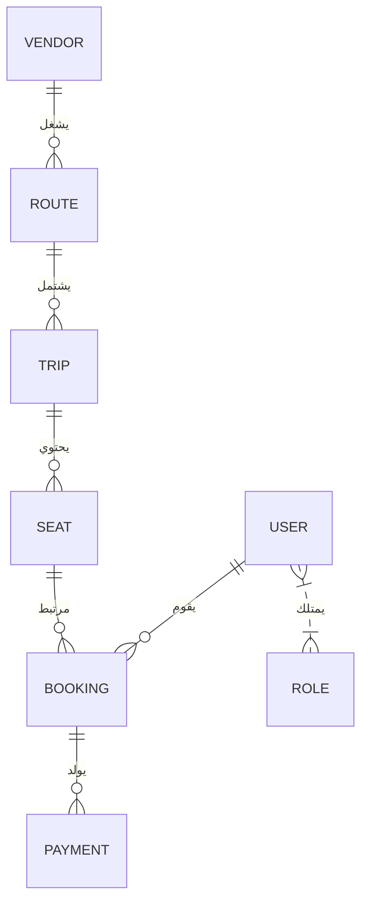

# نظام Pass System ― المنصة الذكية لإدارة النقل والحجوزات

---

## 📝 المحتويات
- [مقدمة عامة عن النظام](#مقدمة-عامة-عن-النظام)
- [المكونات الرئيسية للنظام](#المكونات-الرئيسية-للنظام)
- [المخططات والرسوم المعمارية](#المخططات-والرسوم-المعمارية)
- [تفصيل الأنظمة الفرعية والميزات](#تفصيل-الأنظمة-الفرعية-والمميزات)
- [تدفق العمل واستخدام النظام](#تدفق-العمل-واستخدام-النظام)
- [التقنيات والبنية التحتية](#التقنيات-والبنية-التحتية)
- [المصادر والروابط المفيدة](#المصادر-والروابط-المفيدة)

---

## مقدمة عامة عن النظام

**Pass System** منصة متكاملة لإدارة عمليات النقل الجماعي والحجز وإدارة التذاكر إلكترونيًا. توفر الحلول الذكية للمسافرين والمشغلين والإدارة العليا عبر ربط المستخدمين، الموردين، الرحلات والمقاعد، والمدفوعات بشكل مؤتمت وآمن ومرن.

#### أهداف النظام:
- رقمنة العمليات من التسجيل حتى الدفع.
- الأمان العالي في بيانات المستخدم ودورة الدفع.
- المرونة في توسعة الخدمات وتحسين تجربة العميل.

---

## المكونات الرئيسية للنظام

يعمل النظام عبر سبعة أنظمة فرعية مترابطة كما هو مُوضح أدناه:

| النظام | الوظيفة الأساسية |
|--------|--------------------|
| **النواة الأساسية** | ضبط وتوجيه جميع الأنظمة وحفظ الإعدادات |
| **الهوية** | إدارة صلاحيات وسجلات المستخدمين |
| **المزودون** | ربط وإدارة شركات النقل |
| **المسارات والرحلات** | جدولة وتشغيل الخطوط والرحلات |
| **المقاعد** | توزيع وترخيص حجوزات المقاعد |
| **الحجوزات** | عمليات حجز التذاكر وتتبعها |
| **المدفوعات** | معالجة الدفع وكشف الدخل |

---

## المخططات والرسوم المعمارية

### 1️⃣ مخطط المكونات الرئيسية (Component Diagram)

---

### 2️⃣ مخطط تدفق بيانات عملية الحجز (Data Flow Diagram)

---

### 3️⃣ مخطط تسلسل عمليات الحجز والدفع (Sequence Diagram)

---

### 4️⃣ مخطط العلاقات بين مكونات البيانات (ERD بياني مبسط)

---

## تفصيل الأنظمة الفرعية والميزات

### النواة الأساسية (Core)
- التحكم المركزي ومزايا الربط الذكي بين الأنظمة.
- إعدادات النظام الموحدة وسجلات الاحداث.

### الهوية وإدارة المستخدمين
- إجراءات متقدمة للمصادقة (OTP، تحقق عبر البريد/الجوال).
- صلاحيات مرنة وتخصيص أدوار لكل مستخدم/موظف.

### إدارة المزودين (Vendor)
- تدقيق الوثائق وتسجيل الموردين الإلكتروني.
- مراجعات دورية وتقييم أداء المزودين.

### المسارات والرحلات (Routes & Trips)
- تخصيص متقدم للجداول الزمنية والربط الذكي بين الخطوط.
- تعديلات تلقائية في حالة الأعطال أو تغير الطلب.

### إدارة المقاعد (Seats)
- تحديث فوري لحالة كل مقعد.
- سياسات مرنة لتبديل المقاعد وإدارتها الذكية.

### إدارة الحجوزات (Booking)
- متابعة كل حجز من البداية للنهاية مع إشعارات.
- علاج حالات الإلغاء والاسترجاع والأخطاء.

### المدفوعات والتقارير (Payments)
- تكامل سلس مع جميع بوابات الدفع الحديثة.
- تقارير مالية آنية لإدارة الدخل والمصروفات وأتمتة المحاسبة.

---

## الميزات المركزية

- 🔒 أمان بمعايير عالمية  
- ⚡️ استجابة عالية وحماية من الأعطال المتسلسلة  
- 🔄 واجهات برمجية مرنة (APIs)  
- 📊 تقارير شاملة وإحصائيات تفاعلية  
- 🚀 سهولة الربط والتوسعة المستقبلية

---

## تدفق العمل واستخدام النظام (مثال عملي)

**رحلة المستخدم من التسجيل إلى استلام التذكرة**

1. يسجل دخوله أو ينشئ حساب جديد (مصادقة مزدوجة).
2. يستعرض الرحلات المتوفرة ويبحث حسب الوجهة أو الوقت.
3. يختار الرحلة والمقعد المناسب من المخطط.
4. يتوجه للدفع عبر بوابة إلكترونية آمنة.
5. تصله التذكرة بشكل فوري ويمكنه استعراض تقارير الحجوزات.

---

## التقنيات والبنية التحتية

- لغة البرمجة: _(يرجى ذكر التقنية الفعلية: Python/Node/...)_
- تخزين البيانات: _(مثلاً PostgreSQL/MySQL/...)_
- واجهات برمجية: RESTful/GraphQL
- دعم الحوسبة السحابية والتوسع الأفقي العملي
- حماية متقدمة من هجمات OWASP

---

## المصادر والروابط المفيدة

- [النواة الأساسية](https://github.com/yunis709/Pass_system/blob/main/01-Core-Platform-System.md)
- [إدارة الهوية](https://github.com/yunis709/Pass_system/blob/main/02-User-Identity-Management.md)
- [المزودون](https://github.com/yunis709/Pass_system/blob/main/03-Vendor-Management-System.md)
- [المسارات والرحلات](https://github.com/yunis709/Pass_system/blob/main/04-Route-Trip-Management-System.md)
- [المقاعد](https://github.com/yunis709/Pass_system/blob/main/05-Seat-Management-System.md)
- [الحجوزات](https://github.com/yunis709/Pass_system/blob/main/06-Booking-Management-System.md)
- [الدفع والتقارير](https://github.com/yunis709/Pass_system/blob/main/07-Payment-Financial-System.md)

---

> جميع الحقوق محفوظة - فريق عمل النظام © 2026  
> للاستفسار والتطوير، التواصل عبر مشرف النظام أو الإيميل الرسمي للمشروع.
> 
